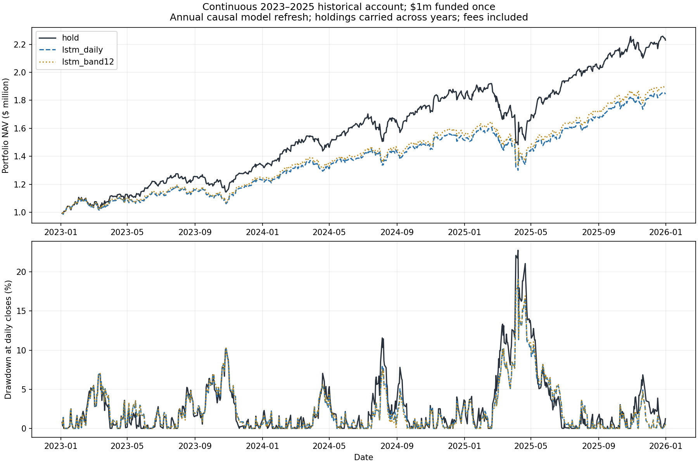
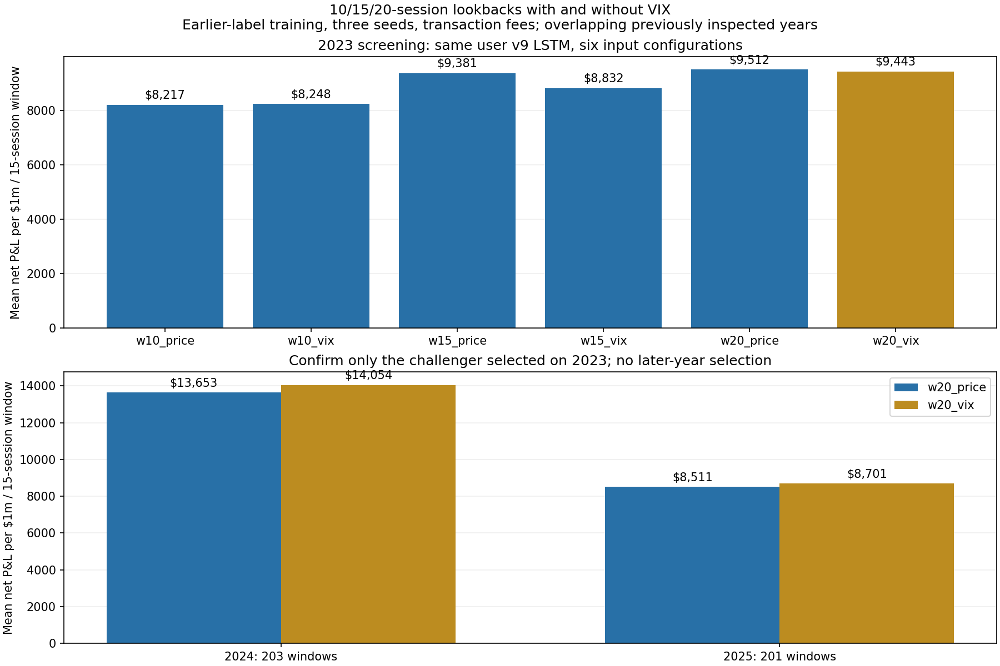

# How this repository powers our ICAIF trading agent

The competition model is built from this repository's `LongShortTermMemory`
factory in `stock_prediction_lstm.py`. It calls
`create_return_multitask_model`, which constructs the v9 shared 128/64 LSTM
encoder. Training extracts the `expected_return` head. The direction and
quantile heads are not claimed trained in this competition experiment.

The architecture file is unchanged. Its SHA256 matches the frozen source
reference for the accepted October 9 Validation ensemble. Archive checks
verify the encoder widths and named return head in the historical and live
models. A source-import training entrypoint and saved input/model hashes make
the lineage inspectable, rather than relying on a matching model name alone.

## The competition additions are maintained here

- `quant_forecast_lab/icaif.py`: causal feature construction, 10/15/20-session
  lookbacks, optional observed VIX features, the portfolio tilt and the
  no-trade band.
- `quant_forecast_lab/icaif_training.py`: three-seed deterministic training
  through the existing v9 factory, purged chronological validation, stopping
  using earlier data, and source/input provenance.
- `tests/test_icaif.py`: future-prefix invariance, VIX alignment, allocation
  constraints and skipped trades.

The competition repository imports these maintained functions. Exact numeric
checks confirm that moving the six-feature construction into this repository
does not change any stored 2023 training/validation/inference input, and that
the allocation adapter matches the established policy. The portfolio engine,
organizer API reader, schedule and private credentials remain in the separate
competition project.

## What changed from the original price-prediction example

The network architecture remains ours. The task-specific differences are:

1. Predict two-session stock returns relative to the equal-weight market,
   using fixed 0.02 scaling rather than a scaler fitted on all observations.
2. Use six causal stock/market/trend features. Each intermediate feature uses
   only its own sequence prefix. Optional VIX features are observed level/40
   and clipped log change/0.1, aligned to completed stock sessions.
3. Fit seeds 7, 42 and 123, average their predictions, and choose checkpoints
   using a purged earlier validation period.
4. Allocate 99% nominal equity: 80% of that equally across 30 stocks and 20%
   across the ten highest scores. Retain shares when proposed buying plus
   selling is below 12% of current NAV; pay 0.1% of each traded notional.

The original frozen LSTM and the enhanced ensemble are distinct fitted
variants of the same user architecture. We do not present other authors'
MASTER architecture or a third-party pretrained checkpoint as our LSTM.

## Reproduce with both source repositories

Clone the LSTM and ICAIF competition repositories as siblings, then use their
documented environments and the organizer's dataset. The competition bridge
defaults to the sibling source directory; `ICAIF_LSTM_SOURCE` can specify a
different checkout. Run from the competition repository:

```powershell
python verify_user_lstm_lineage.py
python continuous_lstm_replay.py
python lstm_lookback_vix_research.py
python prepare_lstm_band_preview.py
```

The preview requires the user's private competition credentials and makes
GET requests only. It writes a shadow review without submission credentials;
it does not upload or alter holdings. Other commands use historical data.
Generated data and models remain outside Git.

The training module can also be invoked from this repository:

```powershell
.venv/Scripts/python.exe -m quant_forecast_lab.icaif_training --input <causal-samples.npz> --output <experiment-folder>
.venv/Scripts/python.exe -m pytest tests -q
```

The samples archive must provide train/validation/inference arrays and strict
date boundaries. This entrypoint is intended for the source checkout where
the original `stock_prediction_lstm.py` is available.

## What the continuous account actually earned historically

The latest experiment carries capital and shares from January 3, 2023 to
December 31, 2025 without annual cash resets. Models refresh annually using
earlier labels. All accounts start with $1m, include fees, and retain final
positions at their endpoint values.

| Policy | Ending NAV | Net profit | Maximum drawdown |
|---|---:|---:|---:|
| Buy and hold | $2,229,838 | $1,229,838 | 25.52% |
| Daily enhanced LSTM | $1,844,097 | $844,097 | 20.70% |
| Enhanced LSTM, 12% band | $1,887,358 | $887,358 | 20.75% |

The band saves about $16,431 in actual simulated fees versus daily LSTM over
this path. Positive profits do not establish market-beating alpha: hold has
the highest total profit here. These are historical proxies, with a fixed
surviving stock universe, excluded incomplete sessions and missing dividends,
market impact and extra slippage. Earlier inspected years are not independent
holdouts or forecasts of future returns. Competition ranking is unverified.

The accompanying 10/15/20/VIX study screens all six configurations on 2023,
then evaluates only the challenger selected there against the fixed control
in 2024 and 2025. The maximum budget is 21 new fits; failed variants are kept
in the evidence. Its protocol and final qualification are stored separately
in `output/lstm-lookback-vix/` in the competition checkout.

Live submission 1481 uses the original enhanced ensemble allocation without
the new turnover band. New research does not silently change that sealed
entry. The organizer executes it at its scheduled boundary; local research
does not have to wait for that boundary.

## Completed lookback and VIX experiment: October 9, 2026

All six configurations use the same user v9 architecture, three seeds and
fees. Screening uses 206 matched 15-session windows in 2023. Mean net profit
per $1m window is $8,217 (10), $8,248 (10 + VIX), $9,381 (15), $8,832
(15 + VIX), $9,512 (20 frozen control) and $9,443 (20 + VIX).

The best new challenger, 20 + VIX, is tested in 2024 and 2025 even though
it is below the control in 2023. Its mean profits are $14,054 versus $13,653
in 2024 (203 windows), and $8,701 versus $8,511 in 2025 (201 windows).
It is **not promoted**: the 2023 profit gate fails, and the 2025 fifth
percentile worsens by 0.2313 percentage points beyond the allowed 0.2.
These windows overlap and are previously inspected; their profits cannot
be added together as a continuous account's earnings.

Fees are already included in every reported profit. The continuous band
account paid $52,474.72 in fees, versus $68,905.79 for daily LSTM. The
separate 2025 annual band account earned $211,245 net after $16,344.58 in
fees. Small live Validation gains have a different horizon and do not
contradict these annual historical numbers or validate them.

A sanitized, reproducible result and lineage snapshot is published in
`docs/evidence/icaif-2026-10-09.json`. Model weights, source market data and
private competition credentials remain outside Git.




