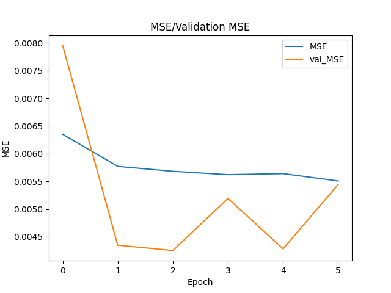
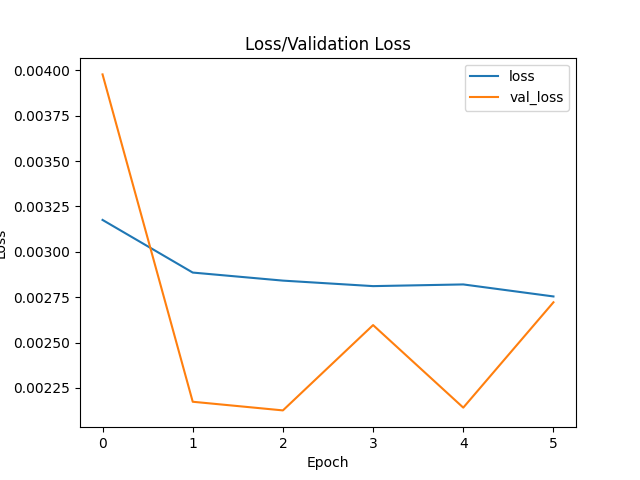

# Reference v7 FTSE run

This historical run is retained solely as a **compatibility fixture** for loading the saved v7 model, scalers and configuration after generated experiment directories were removed from the repository root.

It is not a current benchmark and its saved future forecast should not be interpreted as a live market view.

- Model: v7 direction + magnitude
- Ticker: `^FTSE`
- Time steps: 60
- Original run date: December 2025
- Purpose in the current repository: inference smoke testing and backwards compatibility

## Historical outputs

